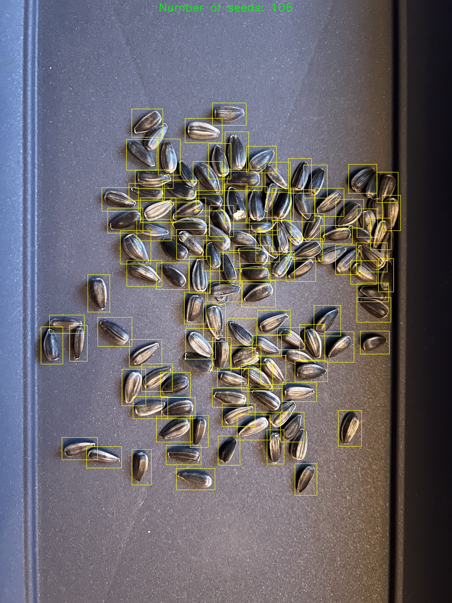

# Seed Counter

Calculate the amount of seeds in an image. The result will be used to predict the total weight after the seeds have been harvested. The reason why the prediction is done using the total amount of seeds is because I expect that the amount in combination with a seed quality prediction score will provide a better input to predict the total weight after harvesting compared to using the initial seed weights as input.

